# Project1. Java CRUD project with file I/O
## 실행 화면 캡쳐 Img
### 설치한 IDE의 이름과 실행화면   
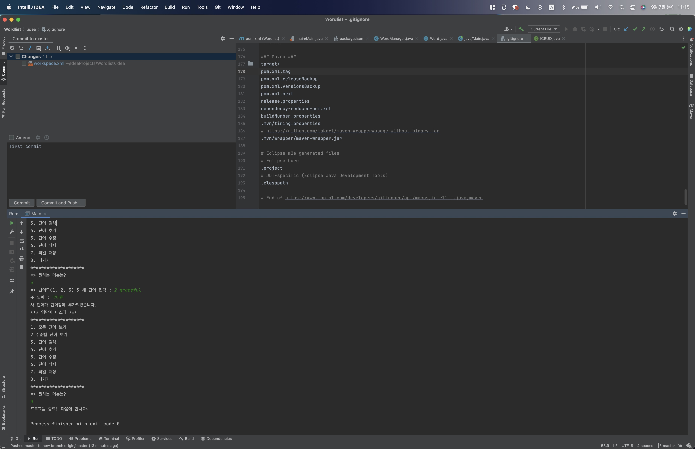

### 단어추가 메뉴 새로운 단어 추가 실행화면   
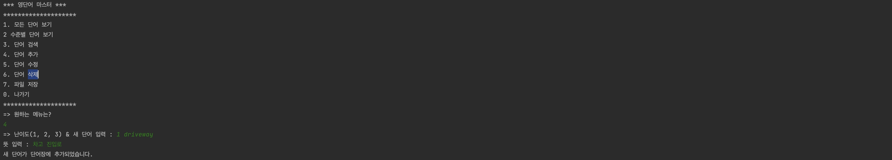
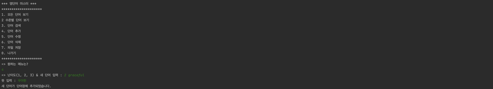

### 모든단어보기 메뉴 실행화면   
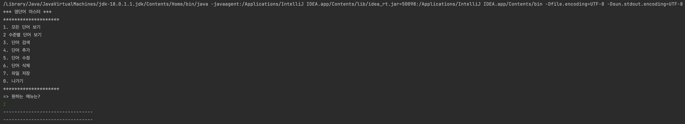

### 나가기 메뉴 실행화면   

### '2. 수준별 단어보기' 실행화면
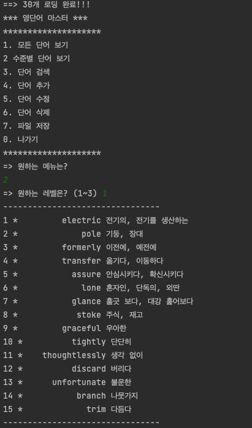

### '3. 단어 검색' 실행화면
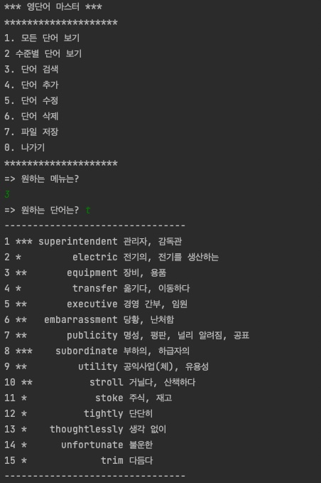

### '5. 단어 수정' 실행화면
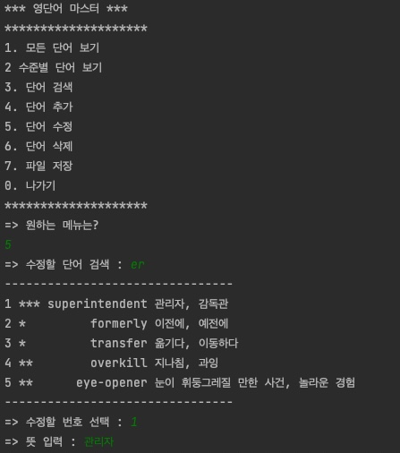
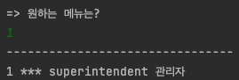

### '6. 단어 삭제' 실행화면
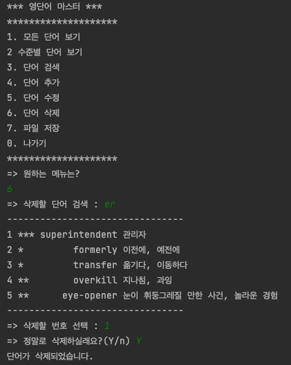

### '7. 파일 저장' 실행화면
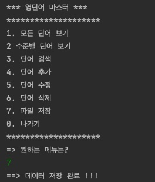

### 파일 내용 - Dictionary.txt

### 프로그램을 새로 실행화면 파일에 있는 모든 단어 가져오고, '1. 모든 단어보기' 실행화면
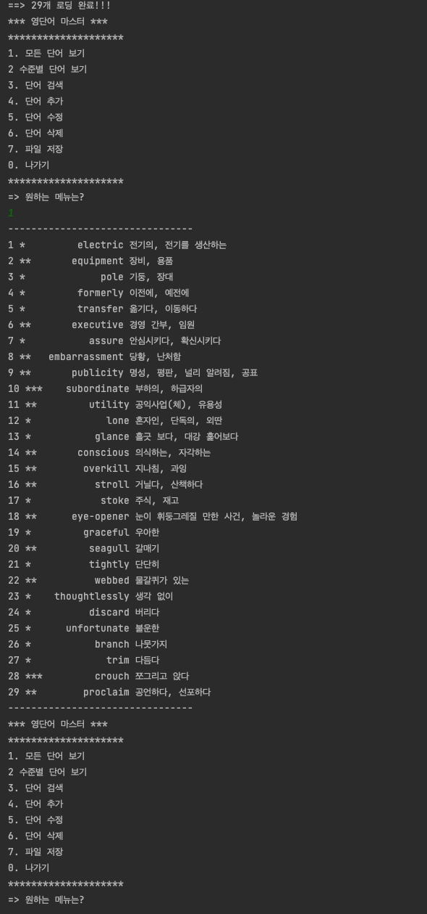